<h2>Project description</h2>
This project is about an app for learning Vocabulary. Basically, the app lets users make their own themes using vocabulary linked to a certain theme, which they can then study and practice with different kinds of tests and activities.

<h2>Project Structure</h2>
The source code folder, there are two directories: 'client_app' and 'server'. The client_app directory is a Flutter project and should be opened with Visual Studio Code. The 'server' is a REST API of Node.js and is included to demonstrate the server's operation.

<h2>Tech Stack:</h2>
- Font-end (Client side): Flutter  
- Back-end (Server side): Nodejs  
- Database: Mongodb (Online Platform)

<h2>Release Application:</h2> Review at Release version 

----

<h2>Running the Project as Dev:</h2>
1) Running Server at server folder (Or using server online running by render.com "https://flutter-quizlet-app.onrender.com")
2) Config server address at client_app/lib/models/Server.dart - variable 'ANDROID_URL'use for mobile and desktop platform (As default it use address of server online)
3) Run "Flutter pub get" to active all library
4) Run flutter project in mobile platform or desktop platform.

<h2>Login Interface:</h2>
Once the application has started, you will see two fields in the login interface: `Email` and `Password`.

You can also sign up in the sign-up interface to set your own email and password.

----

<h3>Demo video:</h3>
https://www.youtube.com/playlist?list=PL-Anf7U-wTjOOlQTQoumJqPuLQbynZh-P

<h2>Review Application:</h2>
<h3>Account and Authentication</h3>
**Login Page:** User must login the app in the firts time. In 30 days the token login will stored in local and use for checking in other access the app.
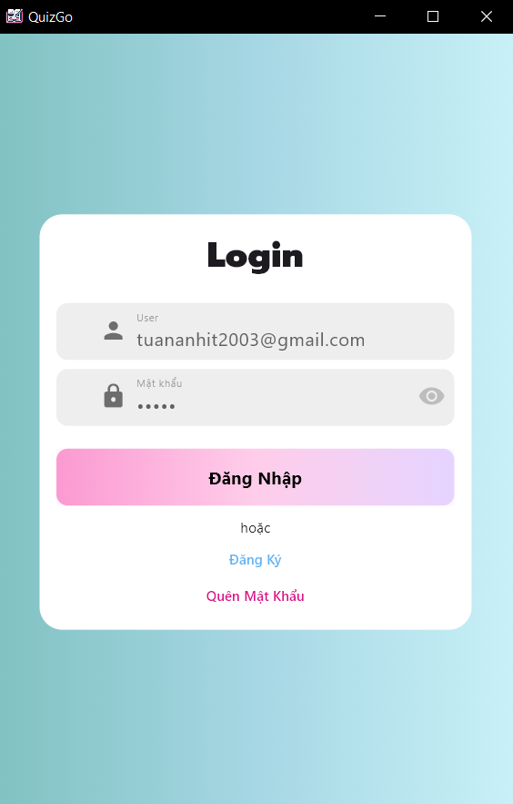

 

**Register Page**: if user not have account, must register account before use the system. By use email to helpful for reset the password when not remember it.
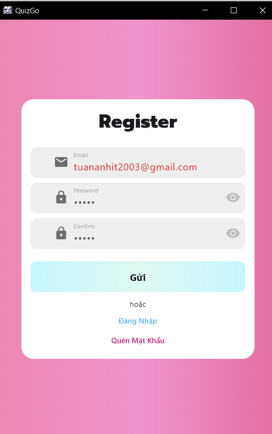

 

**Reset Passwor Page**: If don't remember password, user must use the email that register account before. An mail will send to your email.
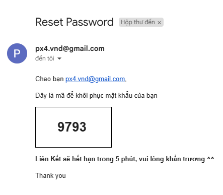
input code reset to change new password.

 

<h3>Library - Topic - Folder - Word</h3>
**Library Page**: this page stored list topic user created in topic tab, and stored list folder in folder tab
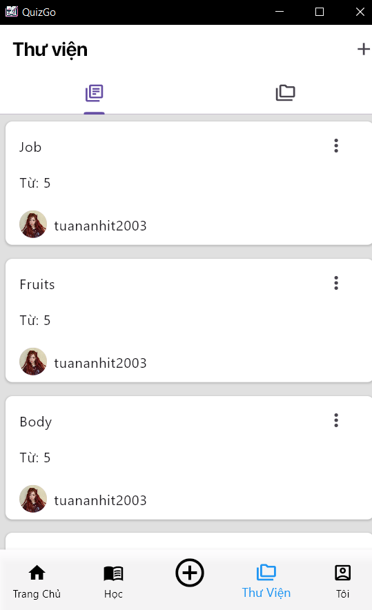
 
**Action with topic - folder**: When clicked more button in topic, you can performed action of topic as edit, delete, export csv
 
**Create new topic**: In this screen, user can create new word as normaly way by click add button one by one. Chose language setting button
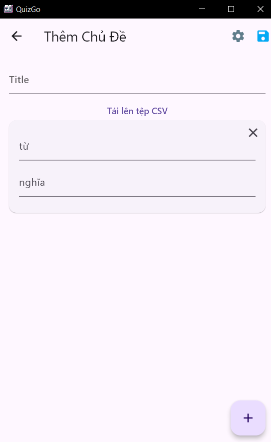
 
In other hand, user can import list word by csv file by click button and select file. Format file follow:
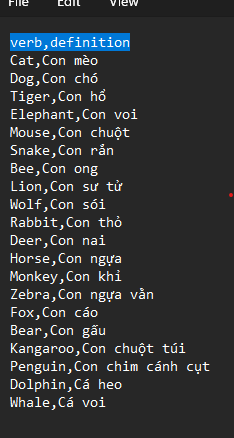
 
**Folder tab**: In there, stored list topic of user or public topic of other user.
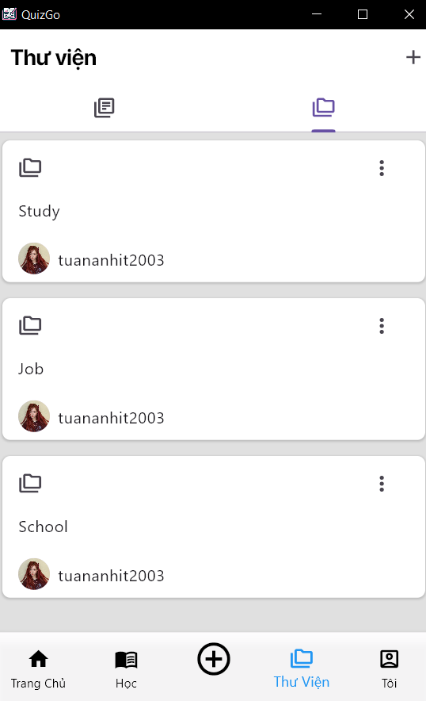
 

<h3>Study Screen</h3>
**Study topic**: when clicked to topic, the new screen will appear. In this, user can see list words, and multi options use for study topic
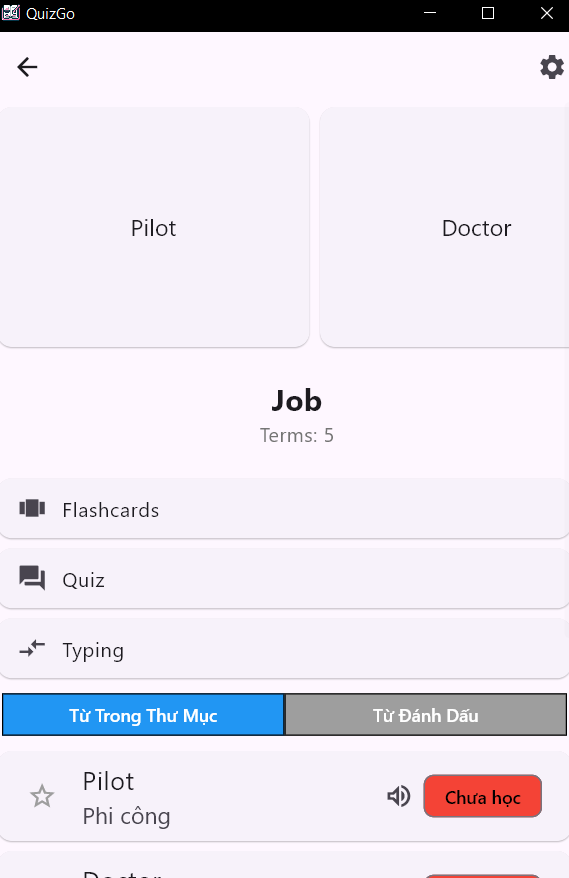
 
In each word, provide a speaker icon to click to hear the pronunciation of each word in the list.  
Each word have 3 status, if study by quiz and typing, the record 1 time, and more than 5 times, the status is master , not study is 0 times, and more than 0 is studied.
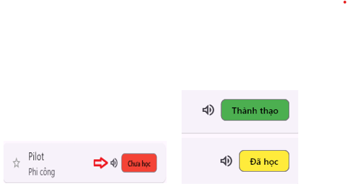
 
**3 mode study**: 
- flash cards
- Quiz : answer of this word + 3 other answer in topic, must have at least 4 word to study this mode
- Typing: By typing answer to study
 
<h3>Home Page</h3>
- In this page, will show list topic of other user, which topic has public type when created
- List topic group by user, each row as a person
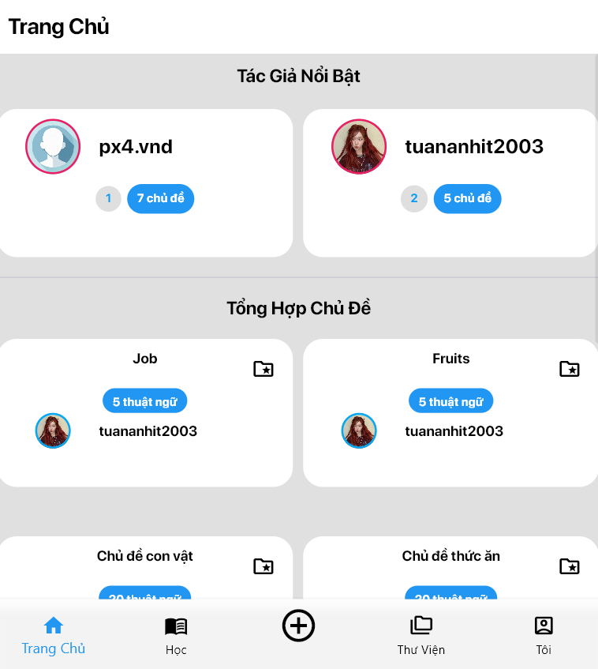
 
<h3>Community Page</h3>
- In this page, list public topic will display and sort by last update
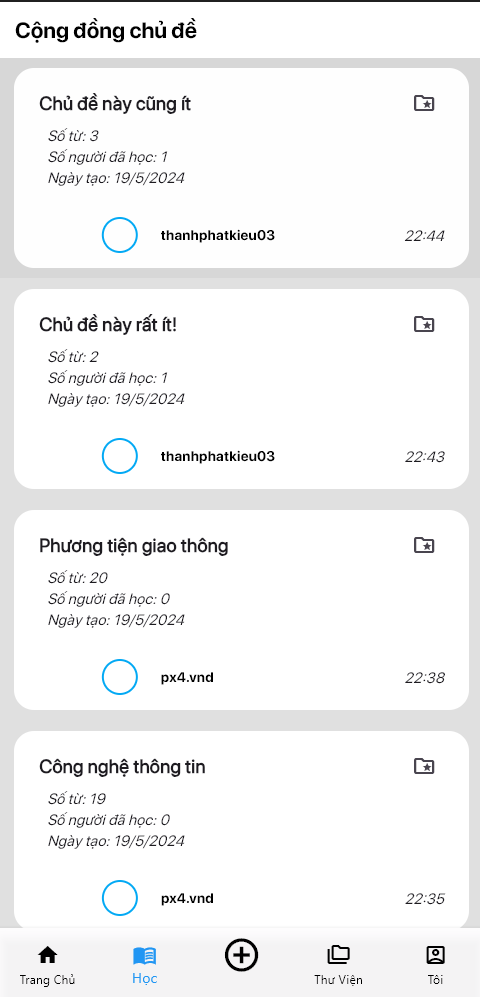

